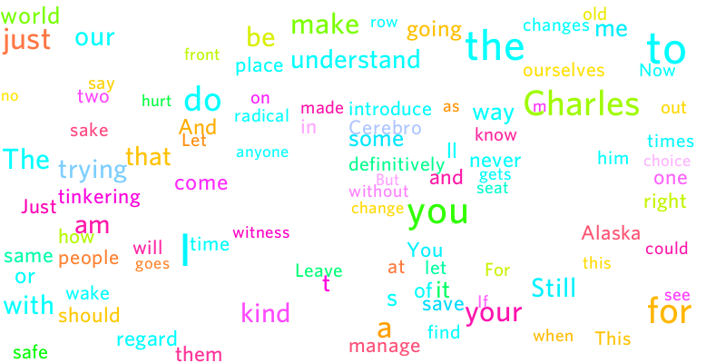

# wordy
This is the new and improved word cloud Discord bot! 

As opposed to the previous Python version, Wordy starts processing the messages as soon as it joins a server and is much faster doing so! 
It also automatically continues to process new messages as they are sent.

*Related blog article: https://teo-orthlieb.github.io/blog/user-word-cloud/*

## How to run it
The Discord Application creation step is usually the same for all bot that you self-host.

### Create a Discord Application
- Go to https://discordapp.com/developers/applications/ and create your app
- Add a bot to it and copy its token. You will need it later!
- Enable `PRESENCE INTENT`, `SERVER MEMBERS INTENT` and `MESSAGE CONTENT INTENT` in the bot tab
- Invite the bot with `https://discord.com/oauth2/authorize?client_id=CLIENT_ID&permissions=101376&integration_type=0&scope=bot+applications.commands` and replace `CLIENT_ID` with the Client ID of your app

**Note:** The OAuth2 link includes following permissions: View Channels, Send Messages, Read Message History (to load messages sent before the bot joined), Attach Files (to send the word cloud image)

### Run it
- Clone the project wherever you want
- add the `token.txt` file at the root of the project (the root of the project is not inside the src folder, instead the folder with the Cargo files and the assets and src folder) and paste the token you copied before into the file (without anything else)
- Install the necessary tools to compile Rust programs with https://rustup.rs/
- With a terminal positioned at the root of the project, run `cargo build --release` to build the project.  
*Note: This will take a while because it's the first build you do, subsequent builds will be much faster.*
- Run the project with `cargo run --release`

### Generate your word cloud
- The bot will load existing messages from the channels it is able to read from.
- Once the messages are loaded (it also works beforehand, which will however not give an extensive result), you can run the bot's slash command `/cloud` to display your word cloud!

#### This is how a word cloud might look like:

